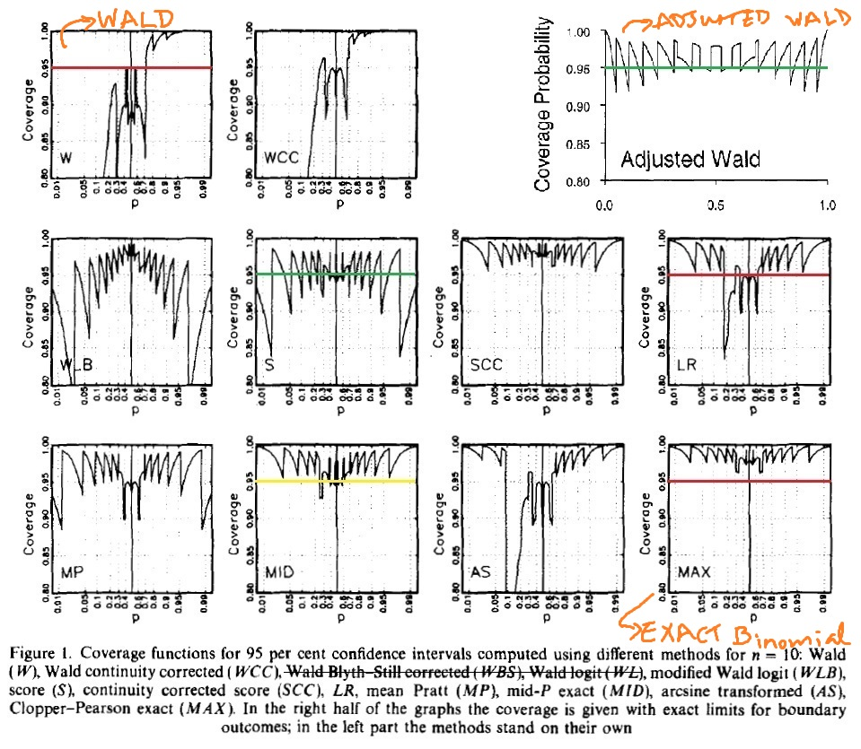

## Question 1: 

We look at the aggregate result:

$n_T = 997,$
$y_T = 229,$
$p_T = y_T/n_T$

$n_c = 995,$
$y_c = 352,$
$p_c = y_c/n_c$


Test statistic:

$z^* = (p_T - p_c) / \sqrt{Var(p_T - p_c)}$

where the variance is:

$Var(p_T - p_c) = Var(p_T) + Var(p_c) = p_T(1-p_T)/n_T + p_c(1-p_c)/n_c$

Thus the test statistic is:

$z^* =  (p_T - p_c) / \sqrt{p_T(1-p_T)/n_T + p_c(1-p_c)/n_c}$

Which we know has a standard normal distribution. 

We find the test statistic to be: 

$z^* = -2.56707$ with $p-value= 0.005128$

```{r}

n_T = 997
y_T = 299
p_T = y_T/n_T

n_c = 995
y_c = 352
p_c = y_c/n_c

z =  (p_T - p_c) / (p_T*(1-p_T)/n_T + p_c*(1-p_c)/n_c)^.5
z

p_T
p_c

pvalue=pnorm(z)
pvalue

```

Now we look at each hospital:

For Princeton Hospital the test statistic is found using:

$n_T = 625,$
$y_T = 116,$
$p_T = y_T/n_T$

$n_c = 48,$
$y_c = 12,$
$p_c = y_c/n_c$

Doing similar calculations as for the aggregate using R, we find the following statistic and p-value. 

$z^* = -0.9999115$ with $p-value =0.15867$

We do this for each of the other two Hospitals using are and we summarize all of our results in the table below.


| Hospital | $p-new Drug$ | $p-usual Drug$ | $z-statistic$ | $p-value$|
|------------|---------------|-------------|---------------|----------|
|$Princeton$| 0.2656|0.25|-0.9999115|0.1586767|
|$County General$| 0.3153153|0.3015075|0.3563215|0.6392001|
|$St. Eligius$| 0.42|0.4007286|0.4244532|0.6643823|
|$Aggregate$| 0.2998997|0.3537688|-2.56707|0.005128|


Looking at the aggregate results we would conclude that there is statistical evidence (p-value = 0.005128) that a higher proportion of people using the new drug experienced an adverse effect than those who used the usual drug. 

However, when we break it down to the individual hospital level, we see that for each hospital there is no statistically significant difference in the proportion of people who experience an adverse effect between those who took the new drug and those who took the usual drug (as all the p-values are greater than 0.05). 

Hence, the investigator would arrive at a misleading conclusion if they were to base their analysis on aggregate counts as clearly simpson's paradox occurs in this case.


```{r, include=FALSE}

n_T = 625
y_T = 166
p_T = y_T/n_T

n_c = 48
y_c = 12
p_c = y_c/n_c

p_T
p_c

z =  (p_T - p_c) / (p_T*(1-p_T)/n_T + p_c*(1-p_c)/n_c)^.5
z
pnorm((p_T - p_c) / (p_T*(1-p_T)/n_T + p_c*(1-p_c)/n_c)^.5)
pvalue = pnorm(z)
pvalue
```


```{r, include=FALSE}
# #For County General Hospital the test statistic is:
# 
# #Latex code
# $n_T = 222,$
# $y_T = 70,$
# $p_T = y_T/n_T$
# 
# $n_c = 398,$
# $y_c = 120,$
# $p_c = y_c/n_c$
# 
# $Z^* = -0.9999115$ with $p-value =
# 
# 
# n_T = 222
# y_T = 70
# p_T = y_T/n_T
# 
# n_c = 398
# y_c = 120
# p_c = y_c/n_c
#   
# p_T
# p_c
# 
# z =  (p_T - p_c) / (p_T*(1-p_T)/n_T + p_c*(1-p_c)/n_c)^.5
# z
# 
# pvalue = pnorm(z)
# pvalue
# 
# 
# #For St. Eligius General Hospital the test statistic is:
# 
# #Latex Code
# $n_T = 150,$
# $y_T = 63,$
# $p_T = y_T/n_T$
# 
# $n_c = 549,$
# $y_c = 220,$
# $p_c = y_c/n_c$
# 
# $Z^* = -0.9999115$ with $p-value =
# 
# ```{r}
# 
# n_T = 150
# y_T = 63
# p_T = y_T/n_T
# 
# n_c = 549
# y_c = 220
# p_c = y_c/n_c
#   
# z =  (p_T - p_c) / (p_T*(1-p_T)/n_T + p_c*(1-p_c)/n_c)^.5
# z
# 
# p_T
# p_c
# 
# pvalue = pnorm(z)
# pvalue
```

***

## Question 2

The proportion of people diagnosed with colorectal cancer was $p_1 = 0.003649$ among participants with daily intake of processed meat of 80 g or more and $p_0= 0.002723$ among participants with lower intake of processed meat.

The difference in proportion is:

$$p_1-p_0 = 0.003649 - 0.002723 = 0.000926$$

This means that the difference in the proportion of people diagnosed with colorectal cancer who ate 80g or more of processed meat daily and those who who consumed less, is 0.000926.  

The relative risk is:

$$p_1/p_0 = 0.003649/0.002723 = 1.34006$$

This means that people who had a daily intake of processed meat of 80 g or more were 1.34 times more likely to be diagnosed with colorectal cancer compared to those with lower intake of processed meat. 

Clearly relative risk is more informative because in a study looking at the probability or risk of being diagnosed with cancer between two different groups, one is interested in knowing what is the risk of cancer of a person in one group compared to if he was in the other, and this is more informative.

***

##Question 3 

####Question: State three "real-world" variables X, Y, and Z for which you expect a marginal association between X and Y but conditional independence controlling for Z. 

Let $X$ be the number of clothing items people are wearing, $Y$ be the number of car accidents, and $Z$ be a factor variable for the four seasons. 

Clearly, in winter there are more accidents because of the ice and snow on the roads but because of winter people are also wearing more cloths. Hence, we expect marginal associations between $X$ and $Y$ (number of clothing items and the number of car accidents).

However, if we condition for the seasons, then clearly within winter or any other season, the number of clothing items and the number of car accidents ($X$ and $Y$ respectively) will be independant.  

***

***

##Question 4

#### Question:  Calculate (show calculations) and interpret a 95% confidence interval, based on the score test, for the proportion of bicyclists wearing a helmet. 

The 95% CI based on the score test is:

$$\frac{1}{(n+z_{\alpha/2}^2)}*\left[(\hat{p}*n + z_{\alpha/2}^2/2) \pm (z_{\alpha/2}\sqrt{\hat{p}(1-\hat{p})n + z_{\alpha/2}^2/4)}\right]$$

Where:

$n = 447$ - number of cyclists sampled,
$x = 175$ - number of cylists wearing helmets,
$\hat{p} = x/n = 0.3915$ - is the proportion of cyclists wearing a helmet, 
$z_{\alpha/2} = 1.96$ as $\alpha = 0.05$

Plugging these values into the 95% CI formula:

$$\frac{1}{(447+1.96^2)}*\left[(0.3915*447 + 1.96^2/2) \pm (1.96*\sqrt{0.3915(1-0.3915)447 + 1.96^2/4)}\right]$$

Gives us the CI: $(0.34736, 0.43748)$

Interpretation of the confidence interval: There is a 95% chance that our confidence interval contains the true proportion of Toronto cyclists who wear helmets. Or, the proportion of Toronto cyclists who wear a helmet is anywhere between 0.3474 to 0.4375. 

Below is the R code used to calculate the CI. 
```{r, eval = FALSE}
z = 1.96
n = 447
y = 175
p = y/n
pc = 1-p
coef = 1/(n+z^2)
a = p*n + z^2/2
b = z*(p*pc*n + .25*z^2)^.5
upperbd = coef*(a+b)
lowerbd = coef*(a-b)
```

***

## Question 5

####Question: Identify a variable for each of the following type of variable from the 2013-2014 dataset for the Canadian Community Health Survey (CCHS):

Note that all the variable were taken from the _Derived and Grouped Variables (PDF) - detailed specifications_ document of the CCHS.

1. _Binary Variable:_ 
* Label: SDCCGT
* Name: Culture/Race flage
    + 1 - white
    + 2 - Non-white
    
2. _Nominal Variable:_
* Label: DHHGMS
* Name: Marital status
    + 1 - Married
    + 2 - Common Law
    + 3 - Widowed/Divorced/Seperated
    + 4 - Single

3. _Ordinal Variable:_
* Label: ALCDTTM
* Name: Type of Drinker
    + 1 - Regular drinker
    + 2 - Occasional drinker
    + 3 - Did not drink in the last 12 months

4. _categorized Continuous Variable:_
* Label: DHHGAGE
* Name: Age
    + 1 - 12 <= DHH_AGE <= 14   (Age between 12 and 14)
    + 2 - 15 <= DHH_AGE <= 17           (etc)
    + 3 - 18 <= DHH_AGE <= 19 
    + 4 - 20 <= DHH_AGE <= 24 
    + 5 - 25 <= DHH_AGE <= 29 
    + 6 - 30 <= DHH_AGE <= 34 
    + 7 - 35 <= DHH_AGE <= 39 
    + 8 - 40 <= DHH_AGE <= 44 
    + 9 - 45 <= DHH_AGE <= 49 
    + 10 - 50 <= DHH_AGE <= 54 
    + 11 - 55 <= DHH_AGE <= 59 
    + 12 - 60 <= DHH_AGE <= 64 
    + 13 - 65 <= DHH_AGE <= 69 
    + 14 - 70 <= DHH_AGE <= 74 
    + 15 - 75 <= DHH_AGE <= 79 
    + 16 - DHH_AGE >= 80          (Age 80 and older)


***

## Question 6

####Question: Using language that an intelligent nonstatistician would understand, describe anticipated relative performance of these intervals for this specific proposal. 

Our $n = 10$ is very small and $\hat{p} = 0.9$. 

Looking at Figure 1 below:

```{r, include = FALSE}
# 
# 
# file:///C:/Users/Faizan/OneDrive/OneDrive/Catagorical Data/HW1/Vollset_1993_Fig1_adapted.jpg

# 
# 

#

#

# 

```



Firstly, we know that the Wald confidence interval's performance is very bad for small sample sizes, as well as for when $\hat{p}$ is close to zero or one. For the proportion of 0.9 it is almost 1. As $\hat{p}$ approaches 0 the coverage probability approaches 80%. Hence, because the actual coverage probability of the 95% CI is in fact very few times 95% it has very poor performance. 

What this means is that the Wald confidence interval of 95% is not actually giving us a confidence interval of 95%. As can be seen from the graph, depending on the value of the proportion, it could be giving a confidence interval of either 80% or almost close to 100%. The other thing is that the confidence interval is quite large which is not good. Hence, because of the poor performance of actually giving a 95% CI very few times, we would not recommond confidence intercal based on the Wald test.

Firstly, we know that the Adjusted Wald test works well for small sample sizes, which is good. Secondly, the confidence interval is narrower than compared to the Wald test CI. Thirdly, we see that for almost all the values of $\hat{p}$ the coverage is mostly 95%. Meaning that most of the time the 95% confidence interval is giving us an actual 95% confidence interval. Thus, because of the small sample size of 10 people, $\hat{p}$ of 0.9, and the very good performance of the Adjusted Wald Confidence Interval, we would recommend that they use this. 

Lastly, as illustrated in Figure 1 above, for the Exact Binomial test, the coverage probability for a 95% CI is alwas greater than 95%. Hence, again it is not giving an actual 95% confidence interval as can be seen in Figure 1, for most of the time. It is very conservative and always gives a higher than 95% confidence interval. Although, since it never goes below 95% it is at least better than the confidence interval based on the Wald test. Thus, its performance is not as good as the Adjusted Wald test, however, it is better than the Wald test. 

In conclusion the Adjusted Wald test confidence interval has the best performance, followed by the exact test confidence interval and then finally the Wald test's confidence interval. 


***

## Question 7

#### Question 7a: Using $\chi^2$ and $G^2$, test the hypothesis of independence between party identification and race. Report the P-values and interpret.

Below is the table of data:
```{r, echo=FALSE}
table = matrix(data = c(192, 75, 8, 459, 586, 471), byrow = TRUE, nrow = 2, ncol = 3)
colnames(table) = c("Democrats", "Independants", "Republicans")
rownames(table) = c("Blacks", "Whites")
table
```

We know that the $\chi^2$ statistic is:

$\chi^2 = \mathop{\sum_{i=1}^{I}\sum_{j=1}^{J}}\frac{(n_{ij} - \hat{\mu_{ij}})^2}{\hat{\mu_{ij}}}$   

with   $df = (I-1)(J-1)$

Where $\hat{\mu_{ij}}= \frac{n_{i+}n_{+j}} {n}$  and  $n_{i+}= \sum_{j = 1}^{J} n_{ij}$

And the $G^2$ statistic:

$G^2 = 2\mathop{\sum_{i=1}^{I}\sum_{j=1}^{J}}n_{ij}log(n_{ij}/\hat{\mu_{ij}})$  

also with $df = (I-1)(J-1)$

Using the command chisq.test() in R we obtain: 

```{r, echo=FALSE}
chisq.test(table)
```

Using the command G.test in the "RVAideMemoire" package we obtain:
```{r, echo=FALSE}
library(RVAideMemoire)
G.test(table)
```

Summarizing the results in the table below:

|       |$Statistic$| $df$|$p-value$|
|-------|-----------|-----|----------|
$\chi^2$|177.31|2|p<<0.0001|
$G^2$|197.39|2|p<<0.0001| 

We conclude that both test give us evidence (p<<0.0001) to reject the null hypothesis of independence between people's race and political identification. Hence, we would conclude that there is an associate between one's race and the political party he identifies with. In particular, black people tend to identify themselves more as democrats. 

***

####Question 7b: Use standardized residuals to describe the evidence of association. 

The standardized residuals for the $i^{th}$ row and  $j^{th}$ column is:

$$r_{ij} = \frac{n_{ij}-\hat{\mu_{ij}}}  {\sqrt{\hat{\mu_{ij}}(1-p_{i+})(1-p_{+j})}}$$
where $p_{i+} = n_{i+}/n$    and  $n_{i+}$ is defined as before. 

Using the command chisq.test(table)$stdres in R we present the standardized residuals table.

```{r, echo=FALSE}
library(knitr)
kable(chisq.test(table)$stdres)
```

The standardized residuals give strong evidence of association. Since the standard reisual for  black democrats is large (+12.5) we can infer that more black people identify themselves as democrates than if the null hypothesis were true, giving evidence between the association of being black and identifying as a democrat. Similarly since the residual for white Republicans is also a large (9.7) more white people identify themselves as republicans than one would expect under the null hypothesis. Hence, there is evidence of a positive association between a white people identifying as Republicans. 

Lastly, since white Democrats and black Republicans have large negative residual values (-12.5, -9.7 respectively) implies that there are fewer people in these catagories than what one would expect if race and political party identification were independent. Hence, there is evidence of a negative association between the two. In lay terms, there is evidence that blacks tend to not be Repulicans. 

***

#### Question 7c: Partition chi-squared into components regarding the choice between Democrat and Independent and between these two combined and Republican. Interpret. 

Using the R code below we do the two partionings and then perform the $G^2$ test of independence on them. Also, note that the values of the two $G^2$ statistics add up to our original $G^2 = 197.39$ value. 

First looking only at the Democrats and Independants. 
```{r}
# Partition chi-squared into components:
table[-3,-3]
```

Performing the test:
```{r}
G.test(table[-3,-3])
```

Since the p-value is very small again (pvalue << 0.0001) we have strong evidence of a difference between the race of white and black people identifying themselves as Independants or Democrats. Blacks are much more likely to be Democrats rather than Indepedant and whites seem  to identify themselves more as Independants. 

Now combining Democrats and Independants into a single column verses the Republicans, using the R code below, we get:
```{r}
n11 = 192
n12 = 75
n13 = 8
n21 = 456
n22 = 586
n23 = 471

Dem.and.Ind = table[,1] + table[,2]
Repubilcans = table[,3]
table2 = cbind(Dem.and.Ind, Repubilcans)
table2

```

Performing the test:
```{r}
G.test(table2)
```

Again, since the p-value is very small (pvalue << 0.0001) we have evidence against the null hypothesis of independence. 

Now, it appears that there are rarely any black Republicans and that most of the Republicans are white. Hence, as p-value is so small we have evidence that very few blacks identify themselves as Republicans, and majority of Republicans are white. 

Secondly, we have strong evidence that most white people are likely to identify themselves as either Democrats or Independants. 

***

## Question 8

#### Question 8a: Use logistic regression to model the effect of temperature on the probability of thermal distress. Plot a figure of the fitted model, and interpret. 
```{r, echo=FALSE}
# Input the data
Ft = c(1, 6, 11, 16, 21, 2, 7, 12, 17, 22, 3, 8, 13, 18, 23, 4, 9, 14, 19, 5, 10, 15, 20)

Temp = c(66, 72, 70, 75, 75, 70, 73, 78, 70, 76, 69, 70, 67, 81, 58, 68, 57, 53, 76, 67, 63, 67, 79)

TD = c(0, 0, 1, 0, 1, 1, 0, 0, 0, 0, 0, 0, 0, 0, 1, 0, 1, 1, 0, 0, 1, 0, 0)

# check if it is correctly done
length(Ft)
length(Temp)
length(TD)

# Combine into dataframe, ggplot cannot handle data in a matrix
daata = as.data.frame(cbind(Ft, Temp, TD))

```

We perform a logistic regression, with Thermal Distress as the Y variable. 
```{r}
# Do logistic regression
model = glm(TD ~  Temp, family = "binomial") 
summary(model)
```
Since the temperature in the model is statistically significant (p-value = 0.032) with a negative coefficient of -0.2322, this clearly implies that the lower the temperature the higher the probability of at least one O-ring suffering thermal distress. 

Now we plot the logistic regression curve:
```{r, echo=FALSE}

# PLot model using ggplot
library(ggplot2)

# Create set of x-values
x <- data.frame(Temp = seq(53, 81, 0.5))

# Predict the fitted values using model
predicted <- as.data.frame(predict(model, newdata = x, type="link", se=TRUE))

# Combine the predicted values and the x-values
newdaata <- cbind(x, predicted)

# # Calculate confidence intervals
# std <- qnorm(0.95 / 2 + 0.5)
# new.data$ymin <- model$family$linkinv(new.data$fit - std * new.data$se)
# new.data$ymax <- model$family$linkinv(new.data$fit + std * new.data$se)

newdaata$fit <- model$family$linkinv(newdaata$fit)  # Rescale to 0-1

# Finally Plot
p <- ggplot(daata, aes(x=Temp, y=TD))
p + geom_point() + 
  #geom_ribbon(data=new.data, aes(y=fit, ymin=ymin, ymax=ymax), alpha=0.5) + # This plot confidence interval.
  geom_line(data=newdaata, aes(y=fit)) + 
  labs(x="Temperature", y="Probability of Thermal Distress (TD)")

```
`
`


Again, from the plot it is clear that the lower the temperature the higher the probability of at least one primary O-ring to suffer thermal distress.  

#### Question 8b:

Our model is:

$$log(p/(1-p)) = \beta_0 + \beta_1*temperature$$

This gives us the equation for the probability to be:

$$p = \frac {exp(\beta_0 + \beta_1*temperature)} {1+ exp(\beta_0 + \beta_1*temperature)}$$

Hence, plugging in the values of the beta's we got from the model and $31^0F$ for the temperature we get:

```{r}
beta0 = 15.0429
beta1 = -0.2322
temp = 31
p = exp(beta0 + beta1*temp)/(1+exp(beta0+beta1*temp))
```

A very large p-value $p = 0.9996$, meaning that at that temperature, there is a very high probability of at least one O-ring suffering thermal stress and an accident resulting due to that. 

***

#### Question 8c: 

#####Question: Construct a confidence interval for the effect of temperature on the odds of thermal distress, and test the statistical significance of the effect. 

To construct a 95% confidence interval for the effect of temperature on the odds of thermal distress we use the R built in command confint() and then exponentiate it.

The confint() command gives us the loglikelihood confidence interval and the reason we use the loglikelihood confidence interval, is because they are transformation invariant. We also know that the Wald confidence interval does not perform very well. Also, the standard error used in the calculation of the CI are based on the expected information from Fisher scoring.   


The loglikelihood confidence intervals are transformation invariant hence since we want the confidence interval for the odds and not log odds we need to exponentiate the upper and lower limits of the CI to get the CI of the odds ratio.

```{r}
confint(model)
exp(confint(model))
```
The 95% profile likelihood confidence interval for the effect on the log odds of suffereing thermal distress is $(-0.5154718, -0.06082076)$, corresponding to  $(0.597, 0.941)$ CI for the odds ratio. 


To test the effect of temperature on the probability of suffering thermal distress we use the loglikehood ratio test statistic:

$$-2(L(Null) - L(Model)) \sim \chi^2(1)$$

```{r, echo=FALSE}
# Firt we do a loglikehood ratio test
anova(model, test = "Chisq")

# #OR Can also do it mannually
# NullDev = 28.267 
# ResidDev = 20.315
# statistic = NullDev - ResidDev
# pvalue = chisq(statistic, 1, lower.tail = FALSE)

```

We find that for the Loglikelihood ratio test with 1 degree of freedom, has a test statistic of 7.952 and a p-value of 0.004804. Hence, the effect of temperature on the probability of suffering thermal distress is statistically significant. 


```{r, include = FALSE}
# Now we do a Wald test
library(aod)
wald.test(b=coef(object=model), Sigma=vcov(object=model), Terms=2)
```


##Question 9

####Question: Construct the log-likelihood function for the model logit[7r(x)] = a + fix with independent binomial outcomes of yo successes in «o trials at x = 0 and y\ successes in n i trials at x = 1. Derive the likelihood equations, and show that 0 is the sample log odds ratio.

Question continued on the next page. 


```{r, include=FALSE}
#Since this is two independent binomial outcomes the joint probability function is

#$$L(\beta, \alpha) = \prod_{i = 1}^{N} \pi(x_i)^{y_{i}} (1-\pi(x_i))^{n_i - y_i}$$

# $$= \left( \prod_{i = 1}^{N} exp \left(log\left(frac{\pi(x_i)} {1-\pi(x_i)}\right)\right) \left(\prod_{i = 1}^{N}(1-\pi(x_i))^{n_i}\right)$$
```

